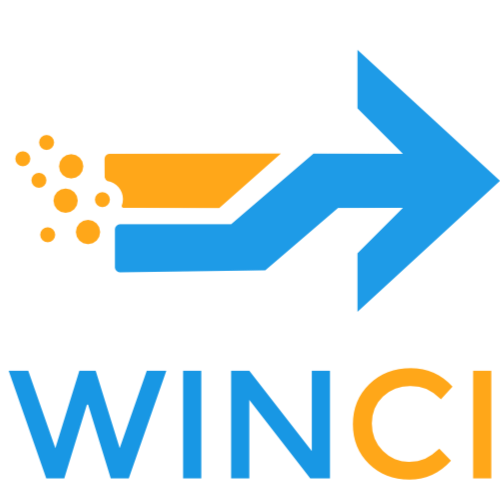

<p align="center">
  
</p>

# WINCI — PC-to-PC Data Crossing

**Version 0.6.1**

Move files and browser data from an **old Windows PC** to a **new one** — two
ways, your choice:

- **Direct cable** — a single Thunderbolt 3/4 or USB4 cable between the PCs.
- **IP address** — any Wi-Fi or Ethernet network; just type the new PC's IP.

Either way there's no cloud and no accounts — the data crosses directly,
**end-to-end encrypted**.

Built with **Tauri v2** (Rust core + a React/TypeScript UI).

## Branding

- Logo: `src/assets/WINCI.svg` (shown on the app's start screen and this page).
- Icon pack: `src/assets/WINCI.ico` (10 sizes, 16–256 px). Copies extracted into
  `src-tauri/icons/` (`icon.ico`, `32x32.png`, `128x128.png`, `128x128@2x.png`,
  `icon.png`) are what `npm run tauri build` bundles into the installer and exe.

---

## How it works

WINCI needs only an IP route between the two PCs, and gets one two ways:

- **Cable**: "Windows Direct Cable Networking" (Thunderbolt Networking /
  USB4NET) exposes the cable as an ordinary network adapter. Both PCs land on
  the same link-local segment (usually `169.254.x.x`) and find each other
  automatically.
- **IP**: on any shared Wi-Fi / Ethernet network, the sender types the IP the
  receiver displays — no cable, no discovery needed.

The transfer protocol is identical on both paths:

```
  OLD PC (send)                         NEW PC (receive)
  ┌───────────────┐   UDP beacon  ◄──── broadcasts { name, tcp_port }
  │ discover_peer │
  │      ↓        │   TCP connect  ────► accept
  │  pair (code)  │   SPAKE2(code) ◄──► PAKE handshake -> session keys
  │      ↓        │   Manifest     ────► create dest tree   (encrypted)
  │  start_send   │   file frames  ────► write files, emit progress
  └───────────────┘                     Documents\WINC Received\crossing-<ts>\
```

- **Discover** — receiver broadcasts a UDP beacon on port `50737`; sender listens.
- **Pair** — new PC shows a 6-digit code; old PC types it. The code drives a
  **SPAKE2** handshake over TCP before any data moves; a wrong code fails the
  handshake cleanly. The connection stays open from pairing through transfer.
- **Connecting by IP** — a first-class path, not a fallback: the sender skips
  discovery and **enters the new PC's IP** by hand (any Wi-Fi / Ethernet
  network). The receiver shows its IP(s); the TCP port is fixed at `50738`, so
  only the IP is needed.
- **Encrypt** — everything after the handshake travels in length-prefixed
  **ChaCha20-Poly1305** AEAD frames with per-direction keys (HKDF-SHA256 from
  the PAKE shared secret). Always on — cable and network alike, no downgrade.
- **Transfer** — length-declared manifest, then chunked file frames (an empty
  frame ends each file, so unreadable files skip cleanly mid-stream). Progress
  is emitted to the UI (`winc://progress`) from whichever side is doing the I/O.

Source of truth for the wire protocol: `src-tauri/src/model.rs`, `net.rs`, and
`crypto.rs`; design rationale in `ENCRYPTION_PLAN.md`.

## What transfers

- **Folders** — Documents, Desktop, Pictures, Downloads, Music, Videos, plus any
  folder you add. Sizes are measured live.
- **Browser data** — bookmarks & history, and (opt-in) saved passwords, from
  **12 browsers**:
  - Chromium family: Chrome, Edge, Brave, Vivaldi, Chromium
  - Opera family: Opera, Opera GX
  - Gecko family: Firefox, Zen, LibreWolf, Waterfox, Floorp

> ☁ **OneDrive cloud-only files** ("available online-only" placeholders) can't
> be read without hydrating them. WINCI skips them cleanly mid-transfer instead
> of aborting the crossing.

> ⚠ **Saved passwords are DPAPI-bound.** Chrome/Edge encrypt them against the
> Windows account. The files copy fine but only decrypt if you sign into the new
> PC with the **same Microsoft account**. The UI states this at the point of
> selection — don't remove that warning.
>
> ⚠ **Close the browser before sending its data** — Chrome/Edge lock their SQLite
> files while running, and locked files are skipped.

---

## Project layout

```
src/                     React UI (the "Signal Bench" design)
  lib/api.ts             backend abstraction: real Tauri calls OR a browser mock
  lib/types.ts,format.ts shared types + number formatting
  store.tsx              app state machine (role -> step)
  components/Cable.tsx   the signature live-cable visualization
  components/...         rail, role picker, session controller
  steps/...              one file per wizard step
  styles/                tokens.css - global.css - app.css
src-tauri/src/
  model.rs               wire types + progress
  net.rs                 link detection, UDP discovery, TCP transfer
  crypto.rs              SPAKE2 handshake + ChaCha20-Poly1305 framed transport
  sources.rs             enumerate + expand folders / browser data
  import.rs              receiver "Import into place": dump dir -> real folders/profiles
  commands.rs            #[tauri::command]s + session state
  lib.rs                 app builder + handler registration
```

### Mock mode
Opened in a plain browser (no Tauri), `api.ts` falls back to a scripted mock so
the whole flow is drivable — useful for design work on non-Windows machines. A
"Demo mode" chip shows bottom-right. The real backend is used automatically
inside the packaged app.

---

## Build & run

### Prerequisites (on the Windows dev machine)
- **Node 18+**
- **Rust** (stable) via <https://rustup.rs>
- **Microsoft C++ Build Tools** (MSVC) + **WebView2** runtime (ships with Win 11)

```powershell
npm install

# hot-reload dev (opens the native window)
npm run tauri dev

# release installer (.msi / .exe in src-tauri/target/release/bundle/)
npm run tauri build
```

> The Rust core targets standard `std::net` + `if-addrs`/`walkdir`/`dirs`. It is
> written on Linux but **must be compiled and tested on Windows** — that's the
> only place the Thunderbolt/USB4 adapter and browser paths exist.

### UI-only preview (any OS)
```bash
npm run dev      # http://localhost:5173  -> runs in mock mode
```

---

## Windows setup for the direct cable

1. Connect both PCs with a **data-rated** Thunderbolt 3/4 or USB4 cable (not
   charge-only).
2. Windows brings up a **Thunderbolt Networking** / **USB4 Net** adapter
   automatically. If not, enable it in the Thunderbolt Control Center / network
   adapter settings.
3. Allow WINCI through **Windows Firewall** (UDP `50737` for discovery, TCP
   `50738` for transfer). Windows classes the cable link as an *Unidentified*
   (Public) network, where the standard first-run prompt (Private-only) doesn't
   help — if the PCs never find each other, use the **"Allow WINCI through the
   firewall"** button on the Connect step; it adds an all-profiles rule via one
   UAC prompt.
4. Run WINCI on both PCs — **Send** on the old one, **Receive** on the new one.

**No Thunderbolt cable?** Skip all of the above: put both PCs on the same
Wi-Fi / Ethernet network, choose **Receive** on the new PC (it displays its
IP), and on the old PC pick **"No cable — connect by IP"** and type that IP.
Same pairing code, same encryption.

---

## Security notes

- **All traffic is end-to-end encrypted, always** — cable and network alike.
  The 6-digit pairing code feeds a **SPAKE2** PAKE (the Magic Wormhole design),
  so a captured handshake cannot be brute-forced offline; a wrong code allows
  exactly one online guess per connection. The derived secret is split via
  HKDF-SHA256 into per-direction ChaCha20-Poly1305 keys with counter nonces —
  no key/nonce reuse across directions. Frame length is capped at 64 MB and the
  handshake has a 10 s read timeout.
- Incoming paths are sanitized (`net::safe_join`) so a manifest cannot write
  outside the destination folder.
- Saved-password files remain DPAPI-bound to the Windows account (see warning
  above) — WINCI never decrypts them itself.

## Version notes

**0.6.1** (current)
- Rebranded to **WINCI**: new logo (`src/assets/WINCI.svg`) and full icon pack
  (`src/assets/WINCI.ico` → `src-tauri/icons/`) used by the built app and
  installer; product name / window title / UI copy updated.
- Copy now presents the two connection paths — **Thunderbolt/USB4 cable** and
  **IP over Wi-Fi/Ethernet** — as equal options throughout the UI and README.
- (Data folder remains `Documents\WINC Received` — unchanged for
  compatibility with earlier crossings.)

**0.6.0**
- **Overwrite?** — browser imports skipped as "not fresh" now show an
  Overwrite? button in the report. Forcing it first backs the new PC's
  existing files up to `WINC Received\crossing-<ts>\Backup\<Browser>\`,
  then replaces them; if any backup fails, nothing further is overwritten.
- **Snapshot log** — every import run writes `import-log-<ts>.json` in the
  crossing folder recording each file's source → destination and outcome
  (`copied` / `kept-both` / `backed-up` / `overwrote` / `failed`), so any
  import can be traced or undone by hand.

**0.5.0**
- **Select all** — one-click select/deselect of every source group on the
  sender's payload step.
- **Import into place** — new button on the receiver's Done screen moves the
  crossing out of `Documents\WINC Received` into the real user folders and,
  when safe, into installed browsers (`import.rs`). Rules: nothing is ever
  overwritten (duplicates kept as "name (from old PC)"); custom folders land
  in `Documents\<name>`; browser data imports only into a browser with no
  existing data — otherwise skipped with a "sign in and sync" hint. Per-group
  results shown as a report.

**0.4.2**
- UI-freeze fix: long-running commands (`receive`, `start_send`, `pair`,
  `discover_peer`, `list_sources`, `allow_firewall`) were synchronous, and
  Tauri v2 runs sync commands on the main thread — the receiver froze
  ("Not Responding") from accept through the whole transfer, never rendered
  `winc://paired`/`winc://progress`, and stayed stuck on the code screen while
  data landed. All now `async` + `spawn_blocking`, so both windows stay live
  and show progress.

**0.4.1**
- Cable detection fix: adapters are now enumerated via `GetAdaptersAddresses`
  (ipconfig crate) instead of if-addrs, which only reported adapters that
  already held an IPv4 address — the Thunderbolt/USB4 P2P adapter is IPv6-only
  for its first ~5–30 s after link-up (DHCP timeout before APIPA), so the
  plugged-in cable was invisible. The UI now shows "cable detected, waiting
  for address" during that window, plus a manual static-IP tip if APIPA never
  arrives.

**0.4.0**
- End-to-end encryption: SPAKE2 pairing-code handshake + ChaCha20-Poly1305
  framed transport, always on (`crypto.rs`).
- Browser support expanded from 3 to 12: added Brave, Vivaldi, Chromium,
  Opera, Opera GX, Zen, LibreWolf, Waterfox, Floorp.
- Cable patch: one-click "Allow WINC through the firewall" (all profiles,
  fixes the Unidentified/Public-network block that broke discovery).
- OneDrive patch: chunked file framing; cloud-only placeholders and other
  unreadable files skip cleanly mid-transfer.
- Receiver fix: "Start over" now unblocks the accept loop, stops the beacon,
  and clears leftover session state, so re-pairing works.

**0.1.0** — initial release: Thunderbolt/USB4 direct-cable transfer, UDP
discovery, 6-digit pairing, manual-IP fallback, Chrome/Edge/Firefox data.

## Status

Frontend: complete, typechecks, builds. Rust core: complete and written to
standard APIs; compile/run happens on the Windows build machine (no Rust
toolchain on the authoring box).
